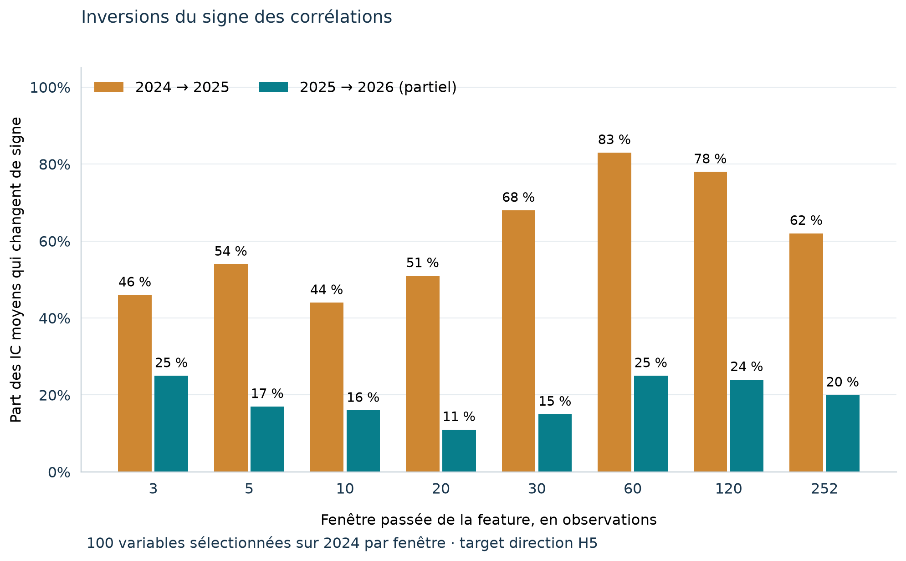
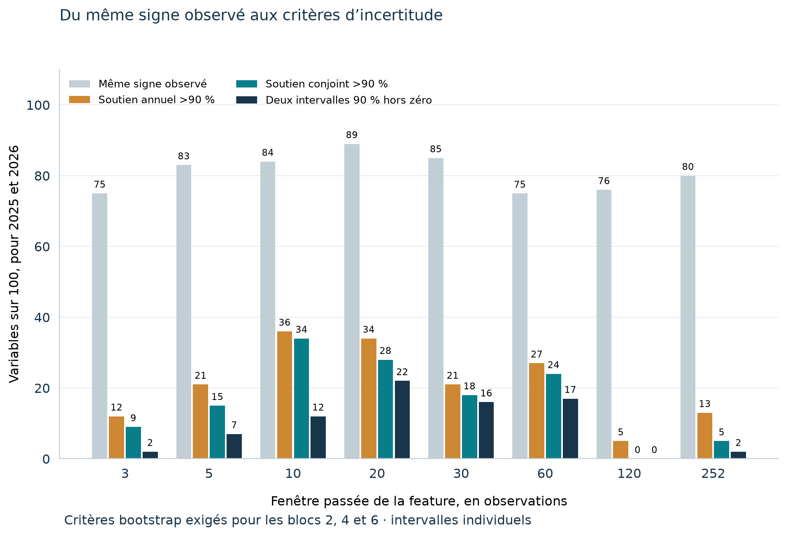
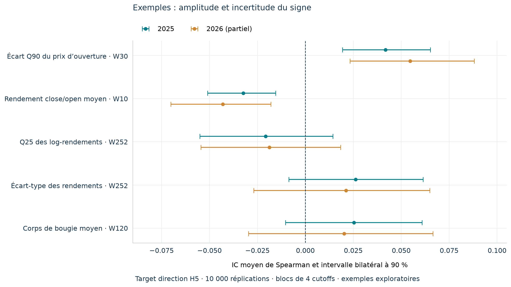

# Exploration des corrélations — synthèse complète

**Hocus Quant Lab · version 1 · 5 octobre 2026**

[Lire la version PDF](EXPLORATION_CORRELATIONS_SYNTHESE.pdf)

**Suite de cette phase :** [SPEC-006T — contrat ex ante et candidate lock H5](SPEC_006T_EX_ANTE_RESEARCH_CONTRACT.md)
a depuis séparé l'éligibilité à T de la qualité future. Le présent bilan conserve les chiffres et
les limites des expériences initiales ; les résultats corrigés sont dans SPEC-006T.

**Avancement au 6 octobre 2026 :** le [journal des étapes suivantes](RESEARCH_PROGRESS_2026_10_06.md)
documente SPEC-007/008, les simulations SRD, les indices et les sept régimes SBF 120.
Le présent document reste le bilan historique de la phase de corrélations du 5 octobre.

**Objet :** bilan de la phase exploratoire, depuis les données et les features jusqu’aux comparaisons 2024–2026 et à l’incertitude des coefficients de corrélation.

**Périmètre principal :** actions du corpus ABC Bourse SRD Paris. Le scan initial couvre aussi d’autres familles d’actifs. Les comparaisons détaillées ci-dessous portent sur le scope `equity`, sauf mention explicite.

**Statut :** résultats descriptifs et diagnostics méthodologiques. Les dates de validation ont été examinées à plusieurs reprises pendant l’exploration ; une confirmation indépendante demande une nouvelle période réservée à cet usage.

## Synthèse de lecture

La phase exploratoire a permis de construire et d’interroger une chaîne complète **prix → features historiques → targets futurs → corrélations par date → comparaison des périodes → estimation de l’incertitude**. Elle n’a pas produit de modèle prédictif, de portefeuille, de backtest avec exécution et coûts, ni de preuve d’alpha.

Le résultat initial le plus frappant — **479 inversions de signe sur 500 relations entre 2024 et 2025** — concerne une sélection presque entièrement H120. L’audit a confirmé plusieurs défauts de recherche : forte superposition des fenêtres futures, calcul d’inférence ignorant cette dépendance, relations redondantes, sélection des extrêmes de 2024 et admission des targets dépendant de leur trajectoire future. Les contrôles indépendants n’ont trouvé aucune inversion triviale dans la formule du rendement, la jointure ou le calcul de Spearman.

Le passage à **H5 uniquement** a donné une autre sélection de 500 relations, toutes vers la **direction absolue à cinq séances**. Les inversions restent fréquentes par rapport à 2024 : **66 % en 2025**, **64,2 % en 2026**. En revanche, entre 2025 et 2026, **81,8 % de ces mêmes relations gardent leur signe**. Ces chiffres décrivent surtout des associations de faible amplitude, dont le signe peut changer autour de zéro.

La sélection de **100 variables par fenêtre historique**, toujours avec la target direction H5, confirme la différence entre périodes. Sur huit tops de 100, les inversions sont **60,75 % entre 2024 et 2025**, puis **19,125 % entre 2025 et 2026**. Les fenêtres historiques 60 et 120 sont particulièrement instables par rapport à 2024, même lorsque le target futur est H5.

Le bootstrap temporel distingue ensuite la simple conservation du signe de son soutien statistique descriptif. Sur ces 800 variables, **169** gardent le même signe avec un soutien bootstrap annuel supérieur à 90 % dans les deux années, **133** dépassent 90 % de soutien conjoint, et **78** ont deux intervalles bilatéraux à 90 % entièrement du même côté de zéro. Ces critères doivent tenir pour les blocs de 2, 4 et 6 cutoffs. Les intervalles sont individuels et ne corrigent pas les comparaisons multiples.

**Conclusion de cette phase :** la stabilité 2025–2026 mérite une recherche complémentaire, mais son interprétation reste conditionnée à la qualité des prix, à l’univers reconstruit et aux filtres existants. Le résultat H120 initial ne permet aucune conclusion confirmatoire. La direction H5 contient des candidats exploratoires, dont la capacité prédictive négociable reste à établir.

### Les chiffres à ne pas confondre

| Chiffre | Population et comparaison | Lecture correcte |
|---|---|---|
| 479/500 inversions | Top rendement/direction tous horizons, 2024 → 2025 | Sélection dominée par H120, fortement dépendante et redondante |
| 330/500 inversions | Nouveau top H5, 2024 → 2025 | Une autre cohorte, toutes les relations vers `direction_abs H5` |
| 91/500 inversions | Même top H5, 2025 → 2026 | 18,2 % de changements du signe de l’IC moyen |
| 153/800 inversions | Tops de 100 par fenêtre, 2025 → 2026 | Cohorte plus large et stratifiée par fenêtre historique |
| 133/800 soutenus >90 % conjointement | Tops par fenêtre, bootstrap 2025–2026 | Fréquence bootstrap ; aucune probabilité d’alpha n’est attribuée |
| 78/800 avec deux intervalles 90 % hors de zéro | Même cohorte, trois tailles de blocs | Critère individuel plus strict, encore exploratoire |

## Sommaire

1. Objet et déroulement de l’exploration
2. Constitution des données et périmètre temporel
3. Construction des features
4. Définition des targets et des horizons
5. Mesure des corrélations et sélection des relations
6. Scan initial et distinction risque/rendement
7. Élargissement au top 500 et audit des inversions
8. Reprise avec les targets H5 uniquement
9. Tops de 100 par fenêtre historique
10. Intervalles de confiance et soutien bootstrap du signe
11. Ce que les résultats permettent de dire
12. Conditions de la prochaine étape
13. Accès interactif, artefacts et reproduction
14. Glossaire et références

## 1. Objet et déroulement de l’exploration

La question générale est de savoir si une mesure calculable à une date T présente une association suffisamment stable avec un résultat futur pour mériter une expérience prédictive ultérieure. Le premier objectif a été de comprendre les données et les associations univariées, avant d’entraîner un modèle.

| Étape | Question examinée | Livrable ou résultat |
|---|---|---|
| Base et qualité | Les prix sont-ils traçables et historiquement utilisables ? | Raw/bronze/silver, DuckDB, contrôles qualité et grade PIT |
| Features historiques | Peut-on calculer des variables à chaque cutoff ? | Registre versionné et cube de features |
| Targets futurs | Quel résultat associer à chaque action et date ? | Neuf familles de targets, cinq horizons et états de disponibilité |
| Scan SPEC-006 | Quelles associations ressortent en 2024 ? | IC par cutoff, déciles, mesures descriptives et classements |
| Comparaison top 100 | Les relations de 2024 gardent-elles leur signe et leur amplitude ? | Séparation entre top général de risque et top de performance |
| Top 500 et audit | Pourquoi observe-t-on 95,8 % d’inversions ? | Contrôles indépendants, sensibilité des filtres et analyse de redondance |
| Reprise H5 | Que devient le résultat à court horizon futur ? | Nouveau top H5 et comparaisons 2024–2026 |
| Comparaison par fenêtre | L’instabilité dépend-elle du passé résumé par la feature ? | Huit tops de 100, plus les indicateurs à fenêtres fixes |
| Incertitude | Quel soutien peut-on attribuer au signe observé ? | Intervalles bootstrap à 90/95 % et fréquences de signe |

Les données AMF et leur ingestion font partie des fondations du laboratoire. **Les corrélations présentées ici portent sur les features dérivées des données de marché ABC Bourse.** Cette phase n’a pas testé un alpha tiré des variations de positions courtes AMF, ni des features macroéconomiques INSEE/Banque de France.

## 2. Constitution des données et périmètre temporel

### 2.1 Source, stockage et déduplication

Les historiques ABC Bourse ont été livrés manuellement en septembre 2026. Le pipeline préserve le contenu source, ses captures et sa provenance, puis produit les couches normalisées et les vues de recherche DuckDB.

| Élément | Corpus observé |
|---|---:|
| Observations SRD distinctes | 199 416 |
| Instruments / ISIN SRD | 197 / 197 |
| Couverture des prix livrés | 29/09/2022 → 28/09/2026 |
| Lignes supplémentaires, huit autres univers | 1 745 030 |
| Codes dans le référentiel de libellés | 2 135, dont 2 067 libellés et 68 non résolus |
| Historique de captures SRD | 321 958 lignes |
| Couples instrument/date présents trois fois | 61 271 |

Le choix de la dernière capture ramène bien la vue SRD à 199 416 observations. L’audit n’a trouvé aucune divergence OHLCV entre les copies concernées. Les répétitions physiques de captures ne constituent donc pas une explication des inversions.

La liste SRD reçue constitue un corpus de titres disponibles dans la livraison. Elle ne documente pas les entrées, sorties, radiations et changements d’appartenance d’un SBF 120 historique. Projeter ce corpus dans le passé ne reconstitue pas l’univers investissable de chaque date.

### 2.2 Ce que signifie le grade PIT reconstruit

Les champs `observation_date`, `published_at`, `retrieved_at`, `valid_from` et `available_at` ont des fonctions différentes. Pour les barres ABC, la disponibilité historique est modélisée à **00:00 Europe/Paris le lendemain de la séance**. La récupération réelle reste celle de septembre 2026.

Cette convention permet une coupe historiquement ordonnée. Elle ne prouve pas que la valeur téléchargée en 2026 était identique à celle disponible en 2024, ni que ses corrections et ajustements étaient connus à cette époque. Les runs portent donc `pit_grade=reconstructed` et `strict_pit_claimed=false`.

Les libellés sont également un référentiel actuel. Ils servent à lire les instruments, sans prouver le nom ou le ticker connu à chaque date historique.

### 2.3 Qualité des prix et composition de l’échantillon

Les statuts `approved`, `review` et `quarantined` sont évalués à partir de l’information retenue à la date du cutoff. Les règles examinent notamment l’enveloppe OHLC, les volumes, les valeurs non finies, les ruptures de prix et les ranges anormaux. Les prix source restent conservés.

La qualité cumulée peut réduire l’univers : après un événement déclenchant un statut de revue, une série peut sortir des cutoffs suivants. Dans l’audit des deux premières périodes :

| Période | Actions par cutoff | Union des actions | Présentes à tous les cutoffs |
|---|---:|---:|---:|
| 2024 | 180–183 | 184 | 178 |
| 2025 | 167–173 | 173 | 167 |

Un ensemble de 165 actions est commun aux 54 cutoffs. Ce sous-ensemble a servi au diagnostic de composition.

Les prix restent insuffisamment certifiés pour un backtest sensible aux corporate actions : aucune série `adjusted_close` accompagnée de ses vintages, ni registre complet d’opérations sur titres, n’est disponible dans la livraison. L’audit trouve par exemple 27 mouvements close/close d’au moins 30 % en 2024 et 32 en 2025. Certains mouvements extrêmes sont compatibles avec des changements d’échelle ou des opérations sur titres, mais leur cause n’est pas établie pour chaque événement.

### 2.4 Périodes réellement analysées

| Période | Cutoffs de features | Résultats H5 utilisables | Statut |
|---|---|---|---|
| Découverte 2024 | 05/04 → 04/10, 27 dates | 27 dates | Six mois de découverte |
| Validation 2025 | 06/04 → 04/10, 27 dates | 27 dates | Fenêtre complète de comparaison |
| Validation 2026 | 05/04 → 28/09, 27 partitions | 05/04 → 18/09, 25 dates | Fenêtre partielle, dernières targets immatures |

« 2024 » et « 2025 » désignent ici ces fenêtres de cutoffs, pas des années civiles complètes. Les résultats futurs H120 d’un cutoff d’octobre peuvent se terminer au printemps de l’année suivante.

Les dates hebdomadaires sont issues d’une grille commune aux familles de marché du corpus. Elles peuvent tomber un dimanche ; le dernier close d’une action reste alors celui de sa dernière séance observée. Cette grille doit être remplacée par un calendrier d’exécution approprié pour un futur backtest Euronext.

## 3. Construction des features

### 3.1 Moteur et définition d’une fenêtre

Le registre contient **1 048 entrées** : statistiques normalisées de niveaux OHLC, tendances, distributions de rendements, structures de bougies, volumes relatifs et indicateurs techniques. Les fenêtres standard sont **3, 5, 10, 20, 30, 60, 120, 252 et 504 observations**. Certains indicateurs ont des fenêtres fixes propres, comme 14, 15 ou 34.

Une fenêtre historique W résume les dernières observations disponibles **jusqu’au cutoff**. Elle n’est pas l’horizon futur H du target. Ainsi, une feature sur 252 observations peut être comparée à une direction future H5.

Les fenêtres portent sur les observations valides de la série, sans interpolation. Dans les tableaux SRD, on les appelle « séances » pour faciliter la lecture ; des trous de série peuvent empêcher leur correspondance avec W séances communes à toutes les actions.

Les identifiants incluent source, transformation, métrique, fenêtre et version de formule. Une modification du sens de la formule demande une nouvelle version. Les valeurs indisponibles sont nulles et accompagnées d’un motif ; elles ne sont pas remplacées silencieusement par zéro.

### 3.2 Exemples de variables utilisées

| Variable | Mesure historique |
|---|---|
| `close.log_return.q25.w252.v1` | Premier quartile des log-rendements journaliers sur 252 observations |
| `close.return.std.w252.v1` | Écart-type des rendements simples sur 252 observations |
| `ohlc.relation.candle_body.w120.v1` | Moyenne de `100 × abs(close − open) / close précédent` sur 120 observations |
| `open.level.q90_delta.w30.v1` | `100 × (quantile 90 % des opens / open courant − 1)` sur 30 observations |
| `ohlc.relation.close_open_return.w10.v1` | Moyenne du rendement intraday `100 × (close − open) / open` sur 10 observations |

Les mesures de niveaux sont normalisées pour limiter les effets d’unité et d’échelle. Un prix brut élevé ne constitue pas une feature canonique de comparaison cross-sectionnelle.

### 3.3 Redondance entre variables

Les transformations monotones peuvent produire le même classement Spearman : variance et écart-type, ou certaines variantes de rendements et de distributions. Plusieurs identifiants ne correspondent donc pas nécessairement à plusieurs informations indépendantes.

Dans le top 500 tous horizons, on trouve **137 features et 98 signatures exactes de rang** en 2024. Dans le nouveau top 500 H5, on trouve **500 features et 420 signatures exactes de rang**. Des corrélations proches, même sans égalité exacte, peuvent encore réduire la diversité économique réelle.

## 4. Définition des targets et des horizons

### 4.1 Les neuf familles et les cinq horizons

Le registre croise neuf familles avec H5, H10, H20, H60 et H120, soit **45 targets**.

| Famille | Résultat futur décrit |
|---|---|
| `return_abs` | Rendement absolu entre le close de référence et le H-ième close futur |
| `return_rel` | Rendement absolu de l’actif moins celui de son benchmark mappé |
| `direction_abs` | Signe du rendement absolu : −1, 0 ou +1 |
| `direction_rel` | Signe du rendement relatif |
| `rank_pct` | Rang percentile du rendement absolu dans la même famille d’entités |
| `volatility` | Volatilité annualisée des log-rendements entre les closes futurs |
| `max_drawdown` | Perte maximale entre sommet et creux dans la fenêtre future |
| `max_upside` | Hausse maximale par rapport au close de référence |
| `max_downside` | Baisse maximale par rapport au close de référence |

Le rendement absolu suit la formule :

```text
R(T,H) = close(T+H) / close(T) − 1
direction_abs(T,H) = sign(R(T,H))
```

Les observations futures ont une date strictement supérieure à T. H désigne un nombre d’observations futures de la série, pas un décalage calendaire. Une fenêtre trop courte reste indisponible ; elle n’est pas ramenée à un horizon plus court.

La volatilité utilise les H−1 log-rendements entre les closes futurs T+1 à T+H. Elle ne comprend pas de rendement impliquant le close de référence. Le drawdown mesure les pics et creux à l’intérieur de cette fenêtre future.

Pour le SRD, le benchmark large mappé est le **CAC AllShares**. Le moteur utilise le H-ième close futur propre à chaque série ; la correspondance exacte des dates de fin actif/benchmark demande donc une attention particulière pour un futur protocole de trading.

### 4.2 Disponibilité et censure

Le moteur distingue les fenêtres futures complètes, la fin de corpus, l’historique futur insuffisant d’un titre, l’absence de benchmark et les statuts de qualité. `candidate_value` conserve une valeur calculable même si le target est ensuite écarté ; `target_value` et le scope `research_ready` déterminent le périmètre du scan publié.

Une target H120 datée septembre 2026 ne peut pas être évaluée à partir d’un corpus s’arrêtant le 28 septembre 2026. La censure de fin d’échantillon explique une partie importante des indisponibilités ; elle doit être distinguée d’une erreur de prix ou d’un historique incomplet propre à un titre.

### 4.3 Défaut d’admission fondée sur le futur

Dans la version étudiée, un contrôle de qualité est réexécuté sur la trajectoire future. Si un événement après T provoque une revue ou une quarantaine, la target est écartée du scope `research_ready`.

**La présence d’une action dans l’échantillon étudié à T dépend alors de ce qui lui arrive après T.** Ce filtrage ex post est un défaut confirmé de sélection. Il reste présent dans les reprises H5 et dans le bootstrap : ces analyses décrivent la cohorte filtrée, elles ne corrigent pas ce mécanisme.

La correction doit conserver une règle d’éligibilité connue à T et un traitement auditable des événements futurs. Elle devra également résoudre les véritables erreurs de prix ; réinjecter une donnée cassée ne constitue pas une réparation statistique.

### 4.4 Convention d’exécution

Une feature peut utiliser le close D et le target actuel démarre à ce même close. Le calcul arithmétique est cohérent, mais l’exécution d’une stratégie après calcul des features demande un prix ultérieur précisément défini, par exemple le prochain open. Cette convention n’est pas encore transformée en backtest.

## 5. Mesure des corrélations et sélection des relations

### 5.1 L’IC cross-sectionnel

À chaque cutoff, on joint les features X et les targets Y sur l’entité, sa famille et la date. On conserve les valeurs disponibles et finies, puis on calcule la corrélation sur les titres de cette coupe.

L’indicateur principal est le **Spearman cross-sectionnel**, calculé avec les rangs moyens pour les ex æquo. Les targets de direction possèdent de nombreux ex æquo puisqu’elles valent −1, 0 ou +1 ; cela est pris en compte dans le calcul.

```text
IC(T) = corrélation entre rang(feature à T) et rang(target futur à T)
IC moyen de période = moyenne simple des IC(T) disponibles
```

Chaque cutoff a le même poids dans cette moyenne. Le coefficient pooled, calculé sur toutes les lignes entité/date réunies, est un autre objet statistique et ne remplace pas cet IC temporel.

**Exemple de lecture :** un IC positif indique qu’à une date donnée les titres présentant une feature plus élevée tendent à avoir un target plus élevé. Avec `direction_abs H5`, cela décrit une association avec la catégorie de direction future. Un IC de +0,04 ne signifie ni +4 % de rendement, ni 54 % de précision, ni 4 % d’alpha.

### 5.2 Signe, amplitude, déciles et rétention

| Mesure | Définition et usage |
|---|---|
| Signe de l’IC moyen | Orientation de l’association sur la période |
| Inversion de signe | IC moyens non nuls de signes opposés entre deux périodes |
| Amplitude `abs(IC)` | Force descriptive de la corrélation |
| Rétention d’amplitude | `abs(IC validation) / abs(IC découverte)` relation par relation |
| Alignement des cutoffs | Part des IC par date ayant le signe de référence |
| Déciles D1 à D10 | Groupes formés séparément à chaque date selon la feature |
| Spread D10−D1 | Écart observé entre les targets moyens des deux déciles extrêmes |

La médiane des ratios d’amplitude n’est pas le ratio de deux moyennes agrégées. Une relation peut conserver son amplitude tout en inversant son signe. Les déciles décrivent l’association dans le même échantillon ; ils ne représentent pas un portefeuille exécuté avec coûts.

### 5.3 Critères de sélection figés sur 2024

L’admissibilité de découverte demande au moins **1 000 couples feature/target**, **13 cutoffs** et **60 % de couverture**. Un IC par date demande au moins **30 couples**. Les 1 000 couples totalisés sont des observations alignées répétées dans le temps ; ils ne constituent pas 1 000 essais indépendants.

Le classement historique est :

1. q-value croissante ;
2. amplitude de l’IC moyen décroissante ;
3. couverture et nombre de cutoffs décroissants ;
4. identifiants pour départager les égalités.

Les tops sont figés sur 2024 et les mêmes relations sont relues dans les périodes suivantes. La comparaison par fenêtre applique la sélection **dans chaque fenêtre avant la troncature à 100**. La reprise H5 filtre l’horizon futur avant de sélectionner les 500 relations.

Les q-values proviennent d’une correction Benjamini-Hochberg séparée par scope, famille de target et horizon. Elles reposent initialement sur un test t temporel naïf, sans correction de la dépendance des IC. Leur rôle dans cette exploration est descriptif. Le classement les conserve pour comparer les expériences ; cela ne valide pas leur usage comme preuve scientifique ou comme classement universel entre familles de targets.

Le scope `eligible` signifie que les critères mécaniques sont remplis. Il n’impose pas de q-value significative. C’est pourquoi un top H5 peut être construit alors que sa meilleure q-value est 0,455.

## 6. Scan initial et distinction risque/rendement

### 6.1 Dimensions du premier scan

Le run initial SPEC-006 du 30 septembre 2026 porte sur les 27 cutoffs de la fenêtre 2024, toutes familles d’actifs présentes dans le corpus.

| Élément | Résultat |
|---|---:|
| Entités par cutoff, toutes familles | 1 650 à 1 674 ; médiane 1 664 |
| Cellules de features dans le cube | 47 047 864 |
| Cellules disponibles | 41 446 793 ; 88,09 % |
| Features présentes dans l’analyse | 1 006, parmi 1 048 entrées du registre |
| Targets | 45 |
| Relations globales testées | 45 270 |
| Relations avec au moins 13 cutoffs | 40 320 |
| Lignes d’historique IC, tous scopes | 6 359 361 |

La somme des observations alignées sur tous les couples feature/target atteint environ 1,7 milliard. Elle compte les mêmes observations répétées pour de multiples relations ; elle ne désigne pas autant de lignes de marché uniques.

Le rapport initial dénombre 22 762 relations globales à q≤0,25 parmi 40 320 admissibles. Ce grand nombre doit être lu avec la multiplicité, la redondance et le chevauchement temporel. Une correction FDR appliquée à un test mal calibré ne répare pas son hypothèse d’indépendance.

### 6.2 Le top 100 général prédit surtout des mesures de risque

Le top général SRD est composé de **95 relations vers la volatilité future** — 30 H60 et 65 H120 — et **5 vers le drawdown H120**. Il regroupe 68 features.

| Période | IC moyen agrégé | Sens conservé vs 2024 | Rétention médiane d’amplitude |
|---|---:|---:|---:|
| 2024 | +0,5168 | Référence | Référence |
| 2025 | +0,5027 | 100/100 | 95,6 % |
| 2026, partiel | +0,4823 | 100/100 observés | 93,0 % |

La maturité 2026 limite fortement ce résultat : les 30 relations H60 disposent d’une médiane de 14 cutoffs, les 70 relations H120/drawdown d’une médiane de **2**. Ces dernières sont classées en validation insuffisante malgré un signe moyen observable.

La persistance d’une association avec la volatilité future est une piste de recherche sur le risque. Elle ne démontre pas une capacité à prévoir le rendement ou sa direction.

### 6.3 Le top 100 de performance est une sélection distincte

Cette sélection restreint les familles à rendement, direction et rang. Elle compte 32 features et 100 relations, toutes H120 : 6 `direction_abs`, 32 `rank_pct`, 31 `return_abs`, 31 `return_rel`.

En 2025, **6/100** gardent le signe 2024, et la rétention médiane d’amplitude est **22,9 %**. L’IC moyen passe de −0,0999 à +0,0482. En 2026, 69/100 ont un IC observable dans cette première comparaison, sur deux cutoffs seulement ; aucune des 69 ne garde le signe 2024. Cette fenêtre H120 2026 ne permet pas une conclusion robuste sur l’année.

Le top général stable et le top de performance instable portent donc sur des targets différents. Les fusionner conduirait à une lecture incorrecte de la prédictivité.

## 7. Élargissement au top 500 et audit des inversions

### 7.1 Composition et résultat déclencheur

Le top rendement/direction élargi compte **484 relations H120 et 16 H60**. Il ne contient aucun target H5, H10 ou H20, même si ces horizons existent dans le registre et étaient candidats.

| Comparaison | Relations évaluables | Inversions | IC moyen de référence → validation | Rétention médiane d’amplitude |
|---|---:|---:|---|---:|
| 2024 → 2025 | 500/500 | 479/500 ; 95,8 % | −0,1019 → +0,0496 | 37,8 % |
| 2024 → 2026 | 367/500 | 355/367 ; 96,7 % | −0,1019 → +0,0653 | 75,2 % parmi les évaluables |

Dans la seconde ligne, les moyennes publiées par l’atlas agrègent des populations de taille différente lorsque des validations manquent. Les 133 relations sans IC et les **492/500 validations classées insuffisantes** imposent une lecture par relation et par horizon. Le chiffre 2026 n’est pas une confirmation sur 500 observations robustes.

### 7.2 Ce qui a été contrôlé indépendamment

| Contrôle | Résultat |
|---|---|
| Vingt targets H120 recalculées depuis les prix historiques | Erreur maximale du rendement : 0 |
| Spearman SciPy sur 20 relations, deux années et 27 cutoffs | 1 080 mesures ; écart maximal ≈ 1,11×10⁻¹⁶ |
| Jointures entité et date | Aucun décalage expliquant les signes sur les contrôles examinés |
| Captures dupliquées | Aucun conflit OHLCV dans les copies auditées |
| Versions de features et targets | Aucun changement de formule identifié comme cause du basculement |

Ces contrôles valident les calculs examinés. Ils n’équivalent pas à une certification générale de chaque ligne source ou de toute la méthodologie de recherche.

### 7.3 Chevauchement temporel et inférence

Deux cutoffs hebdomadaires H120 partagent environ **115 séances futures sur 120**. L’autocorrélation de premier ordre médiane des IC du top atteint **0,748 en 2024** et **0,835 en 2025**.

L’audit ne conserve que **deux fenêtres H120 non chevauchantes** par période avec une sélection gloutonne. Ce nombre ne constitue pas un calcul exact de taille effective d’échantillon, et des fenêtres disjointes peuvent encore être dépendantes. Il montre néanmoins que 27 cutoffs ne représentent pas 27 répétitions indépendantes de cette cible.

Les q-values extrêmement petites du top initial, de l’ordre de 10⁻¹⁴ à 10⁻⁸, ne permettent donc pas de lui attribuer ce niveau de certitude.

### 7.4 Redondance et sélection d’extrêmes

Pour une même coupe SRD et un même échantillon, soustraire le même rendement de benchmark à tous les titres conserve leur rang. Transformer le rendement absolu en percentile conserve également ce rang. L’audit trouve **137 associations feature/horizon comptées trois fois** à travers `return_abs`, `return_rel` et `rank_pct` ; 130 de ces groupes changent de signe, représentant 390 des 479 lignes d’inversion.

Ce constat est propre aux mappings et échantillons comparés. Avec des benchmarks différents par titre ou des disponibilités différentes, l’égalité des rangs ne serait pas automatique.

La médiane de l’amplitude des IC du top tombe de **0,1647 à 0,0636** entre 2024 et 2025. Le nombre de relations dont l’amplitude dépasse 0,10 passe de **466 à 39**. L’étiquette « inversion » masque donc souvent un affaiblissement majeur traversant zéro.

### 7.5 Sensibilité à l’univers et au filtre futur

| Variante sur les mêmes 500 relations | Inversions 2024–2025 |
|---|---:|
| Pipeline publié | 479/500 ; 95,8 % |
| Réintégration des valeurs candidates écartées par qualité future | 485/500 ; 97,0 % |
| Univers commun de 165 actions | 476/500 ; 95,2 % |
| Univers commun et valeurs candidates | 473/500 ; 94,6 % |

Le changement d’univers et le filtre futur ont des effets réels, mais aucune de ces variantes n’élimine l’inversion. Le filtrage futur reste un défaut confirmé ; sa correction ne suffit pas à expliquer ce diagnostic particulier.

Les lignes H120 exclues par qualité future représentent **2,48 % en 2024** et **3,14 % en 2025**. Leurs rendements sont extrêmes et ne sont pas manquants au hasard.

### 7.6 Population entière, placebo et contexte de marché

Parmi **22 400 relations communes admissibles**, tous horizons rendement/direction confondus, **60,2 %** changent de signe entre 2024 et 2025. Le top sélectionné sur 2024 atteint 95,8 %. Un placebo sélectionnant les 500 relations sur 2025, puis les relisant en 2024, donne **34,2 %** d’inversions.

L’asymétrie est importante : le placebo ne reproduit pas un renversement symétrique massif. Ces résultats sont compatibles avec un épisode particulier de 2024, une sélection d’extrêmes et des dépendances communes. Ils n’identifient pas une cause économique unique et ne prouvent pas que tous les changements de signe sont purement artificiels.

À titre de contexte, la moyenne des targets de rendement H120 SRD passe de **−2,78 % en 2024 à +3,94 % en 2025** ; la part des targets positives passe de 41,5 % à 51,1 %. Ce sont des rendements futurs moyens sur des fenêtres superposées, pas les performances annuelles du SRD ou d’un portefeuille.

## 8. Reprise avec les targets H5 uniquement

### 8.1 Nouvelle sélection et concentration sur la direction

Le filtre H5 s’applique avant le classement. On repart des **4 480 relations admissibles de 2024**, soit 896 par famille rendement/direction. Les 500 premières vont toutes vers :

```text
future.direction_abs.h5.v1
Y = +1 si close(T+5)/close(T) − 1 > 0
Y = −1 si ce rendement < 0
Y = 0 si ce rendement est exactement nul
```

Les rendements continus ont bien été candidats, mais arrivent derrière la direction absolue selon la règle historique de classement. Le protocole ne force aucun quota par famille de targets.

La meilleure q-value de découverte de cette cohorte est **0,4549** ; les meilleures q-values descriptives de validation sont **0,5625 en 2025** et **0,7015 en 2026**. Aucune relation de ce top ne satisfait les seuils q≤0,05, 0,10 ou 0,25 dans les tables concernées.

### 8.2 Résultats des mêmes 500 relations

| Période | Cutoffs évalués | IC moyen signé | Médiane de l’amplitude IC | Sens conservés vs 2024 | Inversions vs 2024 |
|---|---:|---:|---:|---:|---:|
| 2024 | 27 | −0,01657 | 0,02807 | Référence | Référence |
| 2025 | 27 | +0,01125 | 0,02296 | 170/500 ; 34 % | 330/500 ; 66 % |
| 2026, partiel | 25 | +0,00848 | 0,02297 | 179/500 ; 35,8 % | 321/500 ; 64,2 % |

La rétention médiane d’amplitude est de 65,9 % en 2025 et de 70,6 % en 2026. **129/500** conservent le signe de 2024 dans les deux validations ; **65/500** conservent aussi au moins 80 % de l’amplitude de découverte dans chacune. La règle complète de l’atlas, incluant la cohérence par cutoff, classe **22/500** relations `stable` dans les deux années.

Entre **2025 et 2026**, directement, **91/500 inversent leur signe et 409/500 le conservent**, soit 18,2 % et 81,8 %.

H5 réduit fortement le chevauchement des résultats futurs entre cutoffs hebdomadaires. Il ne rend pas automatiquement les IC indépendants. La baisse du taux d’inversion par rapport au top H120 ne mesure pas à elle seule l’effet causal de l’horizon, puisque la sélection de relations change également.

### 8.3 Les cinq premières variables de 2024

| Rang | Variable | Fenêtre passée | IC 2024 |
|---:|---|---:|---:|
| 1 | Premier quartile des log-rendements journaliers | 252 | +0,06483 |
| 2 | Premier quartile des rendements journaliers simples | 252 | +0,06483 |
| 3 | Taille moyenne du corps de bougie | 120 | −0,06473 |
| 4 | Écart-type des rendements journaliers simples | 252 | −0,06352 |
| 5 | Variance des rendements journaliers simples | 252 | −0,06352 |

Les deux premières sont des variantes proches. Les deux dernières sont une transformation monotone l’une de l’autre et donnent le même classement. Ce top 5 ne constitue pas cinq idées indépendantes.

Les IC sont faibles. La moyenne signée sur les 500 mélange des orientations positives et négatives ; la médiane d’amplitude et les courbes par cutoff sont nécessaires pour la compléter.

## 9. Tops de 100 par fenêtre historique

### 9.1 Pourquoi cette reprise

Le top 500 global pouvait concentrer certaines fenêtres. La reprise par fenêtre donne à chacune des huit fenêtres admissibles une cohorte de 100 variables. Elle repart du scan complet 2024, maintient la direction H5 et ne sélectionne aucune variable sur les performances 2025 ou 2026.

Les **800 variables standard**, plus **15 indicateurs à fenêtres fixes**, forment une cohorte de 815 relations. Toutes sont évaluables sur 27 cutoffs en 2025 et 25 en 2026.

### 9.2 Inversions par fenêtre et par paire de périodes

| Fenêtre historique | Variables | Inversions 2024 → 2025 | Inversions 2025 → 2026 | Sens conservés 2025 → 2026 |
|---:|---:|---:|---:|---:|
| 3 | 100 | 46 ; 46 % | 25 ; 25 % | 75 % |
| 5 | 100 | 54 ; 54 % | 17 ; 17 % | 83 % |
| 10 | 100 | 44 ; 44 % | 16 ; 16 % | 84 % |
| 20 | 100 | 51 ; 51 % | 11 ; 11 % | 89 % |
| 30 | 100 | 68 ; 68 % | 15 ; 15 % | 85 % |
| 60 | 100 | 83 ; 83 % | 25 ; 25 % | 75 % |
| 120 | 100 | 78 ; 78 % | 24 ; 24 % | 76 % |
| 252 | 100 | 62 ; 62 % | 20 ; 20 % | 80 % |
| Total | 800 | 486 ; 60,75 % | 153 ; 19,125 % | 80,875 % |



*Figure 1 — Mêmes cohortes sélectionnées sur 2024, target direction H5. Les taux sont descriptifs ; les variables sont corrélées et 2026 est partiel.*

Les fenêtres courtes 3, 5, 10 et 20 ne montrent pas l’inversion massive du top H120 : leurs taux 2024–2025 se situent entre 44 % et 54 %. Les fenêtres passées 60 et 120 atteignent 83 % et 78 %, même avec un horizon futur H5.

Entre 2025 et 2026, le taux baisse dans chaque fenêtre standard. Cela établit une stabilité descriptive supérieure de leur signe sur ces deux périodes. Aucune inférence causale de régime ni estimation d’alpha n’en découle.

### 9.3 Fenêtres fixes et fenêtre 504

| Fenêtre propre à l’indicateur | Variables disponibles | Inversions 2024–2025 | Inversions 2025–2026 |
|---:|---:|---:|---:|
| 13 | 1 | 0 | 0 |
| 14 | 7 | 3 | 0 |
| 15 | 1 | 0 | 0 |
| 16 | 1 | 0 | 0 |
| 21 | 1 | 0 | 0 |
| 28 | 1 | 1 | 0 |
| 34 | 3 | 2 | 0 |

Les 15 indicateurs gardent tous leur signe entre 2025 et 2026. Les effectifs de 1 à 7 par fenêtre sont trop faibles pour leur attribuer un taux précis de stabilité généralisable.

La fenêtre **504** n’a aucune variable admissible à la découverte : ses 110 relations n’ont que **3 cutoffs et 475 à 525 couples**, contre les seuils de 13 et 1 000. Elle n’est pas complétée par des variables d’une autre fenêtre ou d’une autre année.

### 9.4 Importance de l’amplitude

Les médianes des amplitudes IC par fenêtre se situent approximativement entre 0,014 et 0,031 en 2024. Une inversion d’un IC de petite amplitude peut correspondre à une fluctuation autour de zéro. Réciproquement, conserver son signe avec un effet faible ne suffit pas à produire une stratégie utile.

Les 500 relations communes avec l’atlas H5 précédent reproduisent les IC moyens à l’arrondi numérique près : écarts maximaux d’environ 2,1×10⁻¹⁷ en 2025 et 1,4×10⁻¹⁷ en 2026. Les différences de taux agrégés viennent donc de la composition des cohortes, et non d’une convention de signe modifiée entre ces deux reprises.

## 10. Intervalles de confiance et soutien bootstrap du signe

### 10.1 Méthode d’incertitude

La méthode estime l’incertitude de la **moyenne temporelle des IC** à univers observé fixé. Elle utilise un bootstrap circulaire par blocs de cutoffs consécutifs, partagé entre toutes les features dans une année, avec des tirages indépendants entre années.

Le calcul emploie **10 000 réplications**, une seed de base **20261005**, et des blocs de **2, 4 et 6 cutoffs**. Le bloc de 4 sert de présentation principale ; les trois tailles sont conservées pour la sensibilité. Elles n’ont pas été choisies en fonction de la meilleure performance.

Chaque réplication calcule la moyenne des IC des dates tirées. Les intervalles bilatéraux sont les percentiles **5 %–95 % pour une couverture nominale de 90 %**, et **2,5 %–97,5 % pour 95 %**. La méthode suit les principes de [bootstrap temporel circulaire](https://arch.readthedocs.io/en/stable/bootstrap/timeseries-bootstraps.html) et d’[intervalles par percentiles](https://arch.readthedocs.io/en/latest/bootstrap/confidence-intervals.html).

Le bootstrap conserve les dépendances observées à l’intérieur des blocs et entre features d’une même coupe. Il suppose une stabilité raisonnable du processus d’IC dans chaque période. Avec 25 ou 27 dates, sa couverture reste une approximation sensible à la taille des blocs et au raccord circulaire.

### 10.2 Trois critères distincts

**Soutien annuel >90 % :** plus de 90 % des moyennes bootstrap gardent le signe observé dans l’année. Pour le critère à deux années, les signes moyens 2025 et 2026 doivent aussi être identiques.

**Soutien conjoint >90 % :** plus de 90 % des paires de réplications 2025–2026 ont le même signe. Deux soutiens annuels de 90 % ne garantissent pas 90 % conjointement : par exemple, deux fréquences de signe positif de 0,90 donnent environ 0,90² + 0,10² = 0,82 de signes identiques sous tirages indépendants.

**Deux intervalles bilatéraux à 90 % hors de zéro :** les deux intervalles se situent entièrement du même côté de zéro. C’est plus strict que le soutien annuel >90 %, puisque les queues de l’intervalle sont à 5 % et 95 %.

Un résultat annoncé « sur les trois tailles de blocs » doit passer le critère pour 2, 4 **et** 6 cutoffs. Aucun choix favorable a posteriori d’une seule taille n’est utilisé pour ces comptages.

### 10.3 Résultats sur les 800 variables standard

| Fenêtre | Même signe, soutien annuel >90 % | Soutien conjoint >90 % | Deux intervalles 90 % hors zéro, même côté |
|---:|---:|---:|---:|
| 3 | 12/100 | 9/100 | 2/100 |
| 5 | 21/100 | 15/100 | 7/100 |
| 10 | 36/100 | 34/100 | 12/100 |
| 20 | 34/100 | 28/100 | 22/100 |
| 30 | 21/100 | 18/100 | 16/100 |
| 60 | 27/100 | 24/100 | 17/100 |
| 120 | 5/100 | 0/100 | 0/100 |
| 252 | 13/100 | 5/100 | 2/100 |
| Total | **169/800** | **133/800** | **78/800** |

*Les trois critères de ce tableau doivent tenir pour les blocs de 2, 4 et 6. Les colonnes correspondent à des critères différents ; elles ne doivent pas être additionnées.*



*Figure 2 — Le signe observé est souvent conservé, tandis que les critères de soutien du signe et d’intervalles hors de zéro sont plus sélectifs. Toutes les barres utilisent les mêmes tops de 100.*

Avec le seul bloc de 4, les totaux seraient **201, 154 et 101**. La sensibilité au choix des blocs est donc visible. Avec les 15 indicateurs à fenêtre fixe, les totaux des trois critères deviennent **179, 142 et 83 sur 815 variables**.

Ces intervalles individuels ne sont pas corrigés pour les 815 comparaisons. Les 78 ou 133 variables ne sont pas des découvertes dont le taux d’erreur global serait contrôlé à 10 %.

### 10.4 Exemples concrets et distinction des périodes

| Variable | IC 2024 | IC 2025 | Intervalle 90 % 2025 | IC 2026 | Intervalle 90 % 2026 |
|---|---:|---:|---|---:|---|
| Écart Q90 open, fenêtre 30 | −0,0148 | +0,0418 | [+0,0194 ; +0,0652] | +0,0546 | [+0,0233 ; +0,0882] |
| Rendement close/open moyen, fenêtre 10 | −0,0084 | −0,0323 | [−0,0510 ; −0,0155] | −0,0430 | [−0,0701 ; −0,0180] |
| Q25 log-rendement, fenêtre 252 | +0,0648 | −0,0207 | [−0,0550 ; +0,0143] | −0,0188 | [−0,0545 ; +0,0184] |

*Intervalles présentés pour les blocs de 4. Les exemples sont illustratifs et ont été examinés après lecture des validations.*

Le premier exemple est bien soutenu positivement en 2025 et 2026, avec un soutien conjoint de 99,89 % pour le bloc de 4 et un minimum de 99,56 % parmi les trois tailles. **Il est pourtant de signe négatif en 2024.** Un soutien actuel des deux années ne signifie donc pas stabilité sur les trois périodes.

Le deuxième exemple garde un signe négatif sur les trois périodes et dispose d’intervalles 2025/2026 hors de zéro dans la présentation principale. Le troisième, premier du classement H5 2024, garde un signe négatif dans les deux validations, mais ses intervalles traversent zéro : signe concordant et signe suffisamment soutenu sont deux propriétés différentes.



*Figure 3 — Intervalles individuels à 90 %, blocs de 4, sur cinq exemples. La ligne verticale indique zéro. Les barres qui le traversent ne déterminent pas nettement le signe avec ce critère.*

### 10.5 Ce que « signe OK >90 % » ne veut pas dire

Le soutien bootstrap est une fréquence de rééchantillonnage. Il ne représente ni la probabilité que le vrai paramètre ait ce signe, ni la probabilité qu’une action monte, ni la probabilité d’un alpha futur.

Une couverture nominale de 90 % décrit une procédure répétée sous ses hypothèses. Elle n’attribue pas 90 % de probabilité au paramètre une fois un intervalle donné observé. Les valeurs proches du seuil ont également une incertitude Monte Carlo : environ 0,3 point de pourcentage d’erreur-type autour de 90 % avec 10 000 réplications.

Le bootstrap ne corrige pas le filtre ex post, les anomalies de prix, la composition reconstruite de l’univers ou les ajustements historiques. Il conditionne ses intervalles au corpus et aux choix déjà effectués.

## 11. Ce que les résultats permettent de dire

### 11.1 Constats établis sur les artefacts examinés

- La chaîne d’alignement et les formules des contrôles examinés sont arithmétiquement cohérentes.
- Le top général porte surtout sur le risque, tandis que les résultats rendement/direction constituent une autre cohorte.
- La sélection rendement/direction tous horizons de 2024 est dominée par H120 et fortement redondante.
- Le chiffre de 95,8 % ne résume pas 500 signaux indépendants et ne dispose pas d’une inférence temporelle valide.
- À H5, le sens est plus stable entre 2025 et 2026 que par rapport à 2024, pour le top 500 et pour toutes les fenêtres standard des tops de 100.
- Des associations H5 possèdent un signe bien soutenu au sens du bootstrap individuel, sous ses hypothèses et dans le corpus filtré.
- Les mêmes signes peuvent coexister avec de faibles amplitudes et des intervalles traversant zéro.

### 11.2 Hypothèses à explorer

Les écarts entre 2024 et 2025–2026 peuvent refléter des différences d’épisode de marché, l’exposition des features à un facteur commun de volatilité ou de retour à la moyenne, la sélection d’extrêmes, ou plusieurs de ces mécanismes. Le travail effectué ne décompose pas quantitativement leur contribution.

Une relation vers la volatilité future peut servir un futur modèle de risque. Une relation H5 de signe soutenu peut servir une expérience prédictive simple. Ces usages demandent chacun un protocole adapté et une confirmation sur de nouvelles observations.

### 11.3 Questions encore ouvertes

| Question | État à la clôture de cette synthèse |
|---|---|
| Le signal direction H5 améliore-t-il une prévision hors période ? | Non établi ; aucun modèle évalué |
| Produit-il un rendement après frais et exécution ? | Non établi ; aucun backtest négociable |
| Est-il stable sur des années et régimes supplémentaires ? | Non établi ; fenêtres de six mois et 2026 partiel |
| L’AMF apporte-t-elle une information prédictive additionnelle ? | Non testé dans cette phase |
| Les 142 candidats bootstrap sont-ils confirmés indépendamment ? | Non ; liste filtrée après examen 2025/2026 |
| Les inférences contrôlent-elles la multiplicité et la redondance ? | Pas encore pour les nouveaux intervalles |
| L’univers et les prix sont-ils strictement PIT ? | Grade reconstruit, vintages et corporate actions incomplets |

**Décision : poursuivre une recherche exploratoire corrigée.** La phase n’autorise pas à présenter les corrélations comme une preuve d’alpha ou à sélectionner une stratégie à partir des taux de signe seuls.

## 12. Conditions de la prochaine étape

### 12.1 Réparer le contrat de recherche

1. **Prix et corporate actions :** identifier et documenter les événements matériels, traiter les erreurs confirmées, préciser les conventions d’ajustement et conserver leur provenance.
2. **Univers daté :** définir une règle d’éligibilité observable à chaque cutoff et documenter les entrées, sorties et survivants. Étiqueter explicitement les périodes pour lesquelles la composition historique demeure inconnue.
3. **Qualité et targets :** fixer l’admission à T, conserver les événements futurs en annotations et adopter une règle auditable pour les résultats réellement ininterprétables.
4. **Calendrier et exécution :** utiliser une grille Euronext et un prix d’exécution après le dernier prix entrant dans les features.

### 12.2 Préparer une confirmation indépendante

5. **Diversité des variables :** regrouper les transformations de rang identiques et les variables fortement corrélées. Fixer des familles de variables compréhensibles avant d’élargir un scan.
6. **Métrique et hypothèse :** choisir à l’avance la target exacte, la règle de sélection et le sens attendu. Distinguer la prédiction du risque de celle de la direction ou du rendement.
7. **Inférence :** fixer une méthode temporelle appropriée, ses paramètres et le traitement des tests multiples. Examiner la sensibilité au faible nombre de dates et aux ruptures de régime.
8. **Nouvelle période :** réserver des données non utilisées pour les réglages, filtres et choix faits à la lecture de 2024–2026. Ces validations déjà explorées servent désormais au développement méthodologique.

### 12.3 Expérience simple ensuite

Une première expérience peut comparer un petit ensemble de variables à des références simples, mesurer leur valeur incrémentale et produire une prévision évaluée en walk-forward. Le protocole devra traiter les horizons futurs aux frontières entre apprentissage et validation, définir l’exécution et mesurer les coûts. L’entraînement d’un modèle intervient après ces choix ; cette synthèse ne spécifie pas encore un modèle ou un portefeuille.

## 13. Accès interactif, artefacts et reproduction

### 13.1 Laboratoire Marimo

Le notebook [`srd_research_lab.py`](../notebooks/srd_research_lab.py) est exposé dans le [sandbox Hocus](https://sandbox.hocus.works/quant-lab-srd/?v=h5), sous authentification.

Son parcours documenté permet de :

1. inspecter les prix et volumes d’une action par ISIN ;
2. examiner les ruptures et les incohérences OHLC ;
3. choisir une relation du top H5, avec 2024, 2025 et 2026 ;
4. recalculer les IC par cutoff et reconstruire les déciles ;
5. comparer les mesures de stabilité et consulter l’audit historique H120 séparément ;
6. lancer des requêtes DuckDB en lecture seule.

Le choix par défaut est **H5 uniquement · top 500**. Le mode candidate d’une relation explore l’effet des exclusions futures ; il ne certifie pas les prix suspects. Les comparaisons par fenêtre et intervalles bootstrap sont disponibles dans les rapports et CSV ci-dessous. Cette synthèse ne prétend pas qu’ils constituent déjà des contrôles UI dédiés dans Marimo.

### 13.2 Livrables de données locaux

| Dossier sous `data/analysis/` | Rôle |
|---|---|
| `spec006-weekly-demo` | Scan initial 2024, manifeste, historique des IC et DuckDB |
| `spec006-period-comparison` | Premières comparaisons top 100 général/performance |
| `spec006r-stability-atlas-top500` | Tops figés tous horizons et métriques par période/famille |
| `spec006r-reversal-audit` | Contrôles indépendants, population commune et placebo |
| `spec006r-root-cause-audit` | Sensibilité des filtres, univers commun et redondance |
| `spec006r-stability-atlas-h5-top500` | Nouveau top 500 H5 et mesures 2024–2026 |
| `spec006r-h5-top100-by-window` | Tops par fenêtre et comparaison 2024–2025 |
| `spec006r-h5-top100-by-window-2025-2026` | Mêmes tops, comparaison 2025–2026 et historique 2026 |
| `spec006r-h5-ic-confidence` | Intervalles, soutiens de signe et liste de candidats |

Les fichiers sous `data/` sont locaux et ignorés par Git. La liste `candidates_joint_sign_support_gt90.csv` contient **142 variables**, dont 133 de la grille standard et 9 indicateurs à fenêtre fixe. Elle est une liste exploratoire filtrée après lecture des validations ; elle demande une confirmation indépendante.

### 13.3 Commandes principales

Depuis la racine du dépôt, dans l’environnement Python 3.12 :

```bash
uv sync --all-extras

# Top 500 H5 : sélection 2024 puis comparaisons 2025/2026
uv run python -m hocus_quant.cli build-stability-atlas \
  --config configs/experiments/stability_atlas_h5.toml \
  --output data/analysis/spec006r-stability-atlas-h5-top500

# Top 100 de 2024 par fenêtre, comparaison 2025
uv run python scripts/compare_h5_by_feature_window.py

# Mêmes relations, comparaison directe 2025/2026
uv run python scripts/compare_h5_windows_2025_2026.py

# Incertitude : blocs 2/4/6, 10 000 réplications
uv run python scripts/bootstrap_h5_ic_confidence.py

# Laboratoire interactif local
make srd-lab
```

Ces commandes supposent les bases de recherche, scans et partitions locales déjà présents. Les scripts ne récupèrent pas de nouvelles données. Les guides détaillés décrivent la génération amont des features et des targets.

### 13.4 Provenance de la synthèse

Cette version résume les artefacts locaux disponibles le **5 octobre 2026**. La branche de travail est `spec/005-target-factory`, avec commit de base `e298231` et des travaux d’analyse/documentation présents dans la copie locale. Le commit de base ne suffit donc pas à retrouver seul tous les livrables de cette phase.

Le fichier compagnon [`EXPLORATION_CORRELATIONS_SYNTHESE.sources.json`](EXPLORATION_CORRELATIONS_SYNTHESE.sources.json) enregistre les chemins et checksums des artefacts utilisés pour les figures et des principaux rapports sources. Les figures sont produites à partir des résultats existants. Aucun nouveau scan scientifique ni import de prix n’est nécessaire pour créer ce document.

Le PDF est exporté à partir de ce Markdown. Son export et les trois figures peuvent être reproduits avec le script [`render_correlation_synthesis.py`](../scripts/render_correlation_synthesis.py), en suivant les indications de son aide. Les dépendances de publication sont chargées ponctuellement et n’ajoutent pas d’infrastructure au laboratoire.

## 14. Glossaire et références

### Glossaire

| Terme | Sens dans cette étude |
|---|---|
| Feature | Mesure historique calculée sur une série à un cutoff |
| Fenêtre W | Nombre d’observations passées utilisées pour la feature |
| Target | Résultat futur attaché à l’entité et au cutoff |
| Horizon H | Nombre d’observations futures utilisé pour ce résultat |
| Cutoff | Date de coupe de l’historique pour fabriquer les features |
| IC | Information Coefficient : ici la corrélation de rang cross-sectionnelle |
| Cross-section | Ensemble des titres comparés à la même date |
| Relation | Couple feature/target avec son horizon, son scope et sa définition |
| Inversion | Changement du signe de l’IC moyen entre deux périodes |
| PIT reconstruit | Disponibilité historique inférée, sans preuve complète des vintages |
| Vintage | Version précise d’une donnée telle qu’elle était publiée ou capturée à une date |
| Censure à droite | Résultat futur incomplet parce que le corpus s’arrête trop tôt |
| q-value | Mesure descriptive issue de la correction multiple appliquée dans le scan |
| Bootstrap par blocs | Rééchantillonnage de groupes de dates consécutives |
| Soutien du signe | Fraction des réplications dont l’IC moyen a le signe de référence |
| Alpha | Valeur prédictive exploitable économiquement, après définition de l’exécution et des coûts ; non établie ici |

### Sources internes

- [Contrat des features](FEATURES.md) et [cube historique SPEC-004](SPEC_004_HISTORICAL_FEATURE_CUBE.md).
- [Targets SPEC-005](SPEC_005_TARGET_FACTORY.md) et [disponibilité/qualité SPEC-005R](SPEC_005R_TARGET_HARDENING.md).
- [Règles point-in-time](POINT_IN_TIME.md) et [qualité des prix SPEC-003Q](SPEC_003Q_MARKET_DATA_QUALITY.md).
- [Définitions statistiques SPEC-006](SPEC_006_SIGNAL_ANALYSIS.md) et [rapport du premier scan](SPEC_006_DATA_REPORT.md).
- [Premières comparaisons 2025/2026](SPEC_006_PERIOD_STABILITY_2025_2026.md) et [contrat de stabilité SPEC-006R](SPEC_006R_PERIOD_STABILITY.md).
- [Audit de bout en bout des inversions](SPEC_006R_REVERSAL_AUDIT.md).
- [Résultats top 500 H5](SPEC_006R_H5_RESULTS.md).
- [Top 100 par fenêtre, 2024–2025](SPEC_006R_H5_BY_WINDOW.md) et [2025–2026](SPEC_006R_H5_BY_WINDOW_2025_2026.md).
- [Incertitude des IC H5](SPEC_006R_H5_IC_CONFIDENCE.md).
- [Guide du laboratoire Marimo SRD](SRD_MARIMO_LAB.md).

### Références méthodologiques

- Documentation arch : [bootstrap temporel](https://arch.readthedocs.io/en/stable/bootstrap/timeseries-bootstraps.html).
- Documentation arch : [construction des intervalles de confiance](https://arch.readthedocs.io/en/latest/bootstrap/confidence-intervals.html).

**Fin de phase :** une infrastructure d’exploration opérationnelle, plusieurs défauts méthodologiques localisés, des associations H5 à documenter, et un protocole de confirmation à préparer sur de nouvelles données après réparation des limites identifiées.
